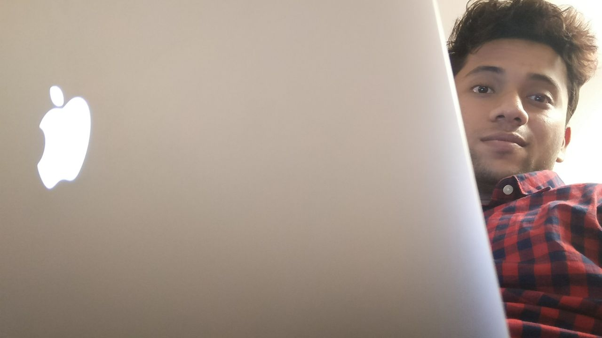

> I love building well designed experiences and working on Video Games AI and Audio.

I'm a MS Computer Science student at the [DigiPen Institute of Technology](https://www.digipen.edu). 
My current focus areas are AI in Video Games and Game Engine Development.I went to [PES University](https://www.pes.edu/) for my bachelors in Computer Science.

I currently Intern at [Roland](https://www.roland.com/us/) as a Software Engineer on the Roland Editor Team.

Previously I used to work at [Danske Bank](https://danskebank.com/) as Software Engineer where I built a continuous deployment framework for the machine learning models at the bank.